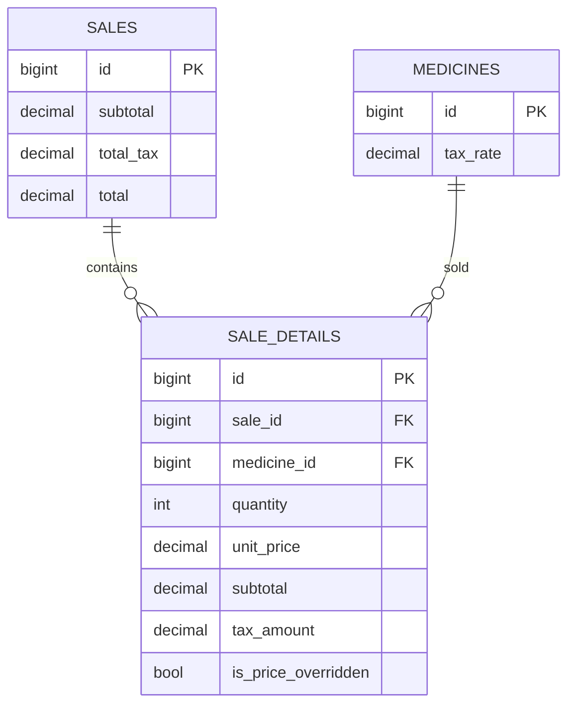

# PROYECTO AKRO
## Para levantar la Base de Datos ejecutar el comando:
docker compose -f docker-compose.dev.yml up -d

## Acuerdos Tecnicos
- El precio de venta actual se gestiona por sucursal y medicamento en una tabla dedicada (`branch_medicine_prices`), evitando un precio global en `medicines`.
- El modulo de venta rapida debe sugerir por defecto el `sale_price` configurado para la sucursal activa, manteniendo `sale_details.unit_price` como snapshot historico de cada venta.
- **Protección de edición de precio unitario**: En el carrito de venta, el campo "Precio unitario" es un botón que abre un modal con advertencia. El modal indica que el cambio de precio solo afecta la venta actual (_snapshot_ en `sale_details`) y no modifica el precio global de la sucursal (`branch_medicine_prices`). Solo tras confirmar en el modal se permite editar el precio.
- Se adopta un sistema visual clínico global (Tailwind v4 via tokens CSS): tipografía base `Manrope`, paleta `brand` y `surface` clínica, colores semánticos `clinical` y sombra `shadow-clinical` para consistencia UI en todos los módulos.
- Se agrega la seccion de historial de ventas en `/sales/history`, consumiendo `sales` y `sale_details` con detalle de lineas por venta y filtros por texto/fecha.
- El modulo `/medicines/stock` se rediseña como listado filtrable por busqueda, sucursal, categoria y estado de inventario, con tabla detallada paginada y metricas de riesgo (stock bajo, sin stock, proximo a caducar).
- En el formulario de medicamentos, no es obligatorio registrar todas las sucursales: se seleccionan de forma explicita desde un desplegable y solo esas sucursales se guardan en `stocks`.
- Se implementa soporte fiscal MX para IVA en ventas: `medicines.tax_rate`, `sales.subtotal`, `sales.total_tax`, `sale_details.subtotal`, `sale_details.tax_amount` y `sale_details.is_price_overridden`.
- En venta rápida el empleado captura **precio bruto** (IVA incluido) y el backend calcula base e IVA por línea con la fórmula `base = bruto / (1 + tax_rate)`.
- Los encabezados principales de cada módulo deben renderizarse a ancho completo (sin margen/padding horizontal del contenedor padre), manteniendo sin cambios el comportamiento de las tarjetas de contenido inferiores.
- El módulo de sucursales centraliza altas y ediciones en modales dentro de `/branches`; no se usan páginas separadas para crear o editar sucursales.
- Al confirmar una venta en `/sales/quick`, el sistema genera un **Ticket de venta PDF temporal** (no fiscal) para previsualizar, imprimir y descargar desde un modal inmediato.
- Las tablas del sistema deben usar cabecera destacada con mayor peso tipográfico y filas intercaladas en blanco/verde claro para mejorar legibilidad.
- Las **Notificaciones** y el acceso de **Perfil** se muestran en la esquina superior derecha del header principal (misma linea del breadcrumb), incluyendo icono de campana con dropdown de alertas de **caducidad** y **bajo stock**.
- Cuando existan productos vencidos o por caducar, la app muestra un aviso temporal flotante en la esquina inferior derecha para solicitar acciones correctivas/preventivas.
- Se incorpora el módulo de **Reporte PDF de ventas por sucursal/rango de fecha** en `/reports/sales`, generando el PDF al momento de hacer clic en descargar.
- En `/settings/profile` se agrega verificación de **correo de perfil** independiente al correo de login (puede ser el mismo o diferente), con envío de enlace firmado y estado de verificación visible en UI.
- Se agrega notificación por correo para inventario crítico (stock bajo y/o próximos a vencer) sin deduplicación diaria: cada ejecución puede reenviar alertas. El envío se dispara cuando una sucursal tiene bajo stock/sin stock, notificando a usuarios verificados de esa sucursal (`admin` y `employee`) y a `superuser` verificados para todas las sucursales.
- En `/settings/profile` el usuario puede cambiar únicamente su **foto de perfil** en una tarjeta dedicada, reutilizando Cloudinary y exponiendo `avatar` desde `profile_photo_path` para toda la interfaz.
- El dashboard operativo consume métricas por rol/sucursal (empleado = su sucursal, admin = vista global), incluyendo KPIs diarios, alertas de stock/caducidad, tendencias de venta, top productos, colaboradores por sucursal y tareas accionables.
- En dashboard se habilitaron selectores dinámicos para ver ventas por hora y ventas diarias en modo total o por sucursal; además, la tarjeta de colaboradores por sucursal muestra todas las sucursales activas.
- La selección de sucursal queda gobernada por rol: solo `superuser` puede elegir entre múltiples sucursales (venta rápida y formularios de medicamentos); `admin/employee` operan únicamente con su sucursal asignada y la UI bloquea cambios de sucursal fuera de ese alcance.
- En creación de usuarios desde `/users`, el rol `admin` tiene la sucursal preasignada y bloqueada (sin selector editable); únicamente `superuser` puede seleccionar sucursal para el nuevo usuario.
- La asignación del rol `superuser` está restringida: `admin` no puede crear usuarios con ese rol ni actualizar usuarios existentes para convertirlos en `superuser` (regla aplicada en formulario y backend).
- El redirect post-login de Fortify ahora valida `url.intended` por rol: usuarios `employee` no son enviados a rutas administrativas (`/medicines`, `/users`, `/categories`, `/active-ingredients`, `/branches`) y se redirigen de forma segura a `/dashboard`.
- El dashboard operativo se ajusta con `minmax(0, ...)` y contenedores `min-w-0` para evitar desbordes horizontales en producción (zoom 100%/pantallas intermedias), garantizando visibilidad del bloque "Alertas operativas".
- El envío de alertas de inventario tras registrar ventas prioriza Brevo API (`BREVO_API_KEY`) y admite destinatario de respaldo (`email` verificado) cuando no exista `verification_email` verificado, con logging de diagnóstico y sin bloquear el cierre de la venta ante fallos de transporte.

## MER Fiscal (Resumen)

