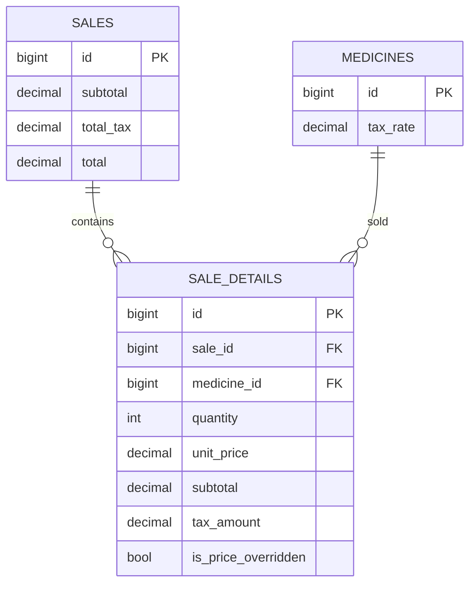

# PROYECTO AKRO
## Para levantar la Base de Datos ejecutar el comando:
docker compose -f docker-compose.dev.yml up -d

## Acuerdos Tecnicos
- El precio de venta actual se gestiona por sucursal y medicamento en una tabla dedicada (`branch_medicine_prices`), evitando un precio global en `medicines`.
- El modulo de venta rapida debe sugerir por defecto el `sale_price` configurado para la sucursal activa, manteniendo `sale_details.unit_price` como snapshot historico de cada venta.
- **Protección de edición de precio unitario**: En el carrito de venta, el campo "Precio unitario" es un botón que abre un modal con advertencia. El modal indica que el cambio de precio solo afecta la venta actual (_snapshot_ en `sale_details`) y no modifica el precio global de la sucursal (`branch_medicine_prices`). Solo tras confirmar en el modal se permite editar el precio.
- Se adopta un sistema visual clínico global (Tailwind v4 via tokens CSS): tipografía base `Manrope`, paleta `brand` y `surface` clínica, colores semánticos `clinical` y sombra `shadow-clinical` para consistencia UI en todos los módulos.
- Se agrega la seccion de historial de ventas en `/sales/history`, consumiendo `sales` y `sale_details` con detalle de lineas por venta y filtros por texto/fecha.
- El modulo `/medicines/stock` se rediseña como listado filtrable por busqueda, sucursal, categoria y estado de inventario, con tabla detallada paginada y metricas de riesgo (stock bajo, sin stock, proximo a caducar).
- En el formulario de medicamentos, no es obligatorio registrar todas las sucursales: se seleccionan de forma explicita desde un desplegable y solo esas sucursales se guardan en `stocks`.
- Se implementa soporte fiscal MX para IVA en ventas: `medicines.tax_rate`, `sales.subtotal`, `sales.total_tax`, `sale_details.subtotal`, `sale_details.tax_amount` y `sale_details.is_price_overridden`.
- En venta rápida el empleado captura **precio bruto** (IVA incluido) y el backend calcula base e IVA por línea con la fórmula `base = bruto / (1 + tax_rate)`.
- Los encabezados principales de cada módulo deben renderizarse a ancho completo (sin margen/padding horizontal del contenedor padre), manteniendo sin cambios el comportamiento de las tarjetas de contenido inferiores.
- El módulo de sucursales centraliza altas y ediciones en modales dentro de `/branches`; no se usan páginas separadas para crear o editar sucursales.
- Al confirmar una venta en `/sales/quick`, el sistema genera un **Ticket de venta PDF temporal** (no fiscal) para previsualizar, imprimir y descargar desde un modal inmediato.
- Las tablas del sistema deben usar cabecera destacada con mayor peso tipográfico y filas intercaladas en blanco/verde claro para mejorar legibilidad.
- El sidebar incluye una sección inferior de **Notificaciones** con conteo de productos vencidos, alertas de caducidad menor a 30 días y mensajes resumidos por producto.
- Cuando existan productos vencidos o por caducar, la app muestra un aviso temporal flotante en la esquina inferior derecha para solicitar acciones correctivas/preventivas.

## MER Fiscal (Resumen)

